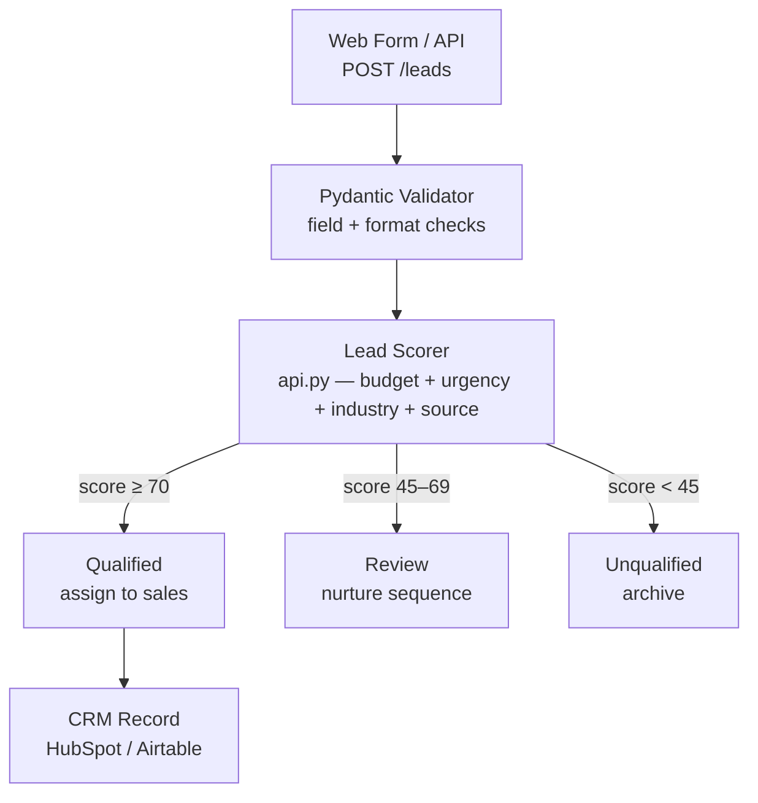

# AI Lead Generation Platform

Lead intake, scoring, and qualification pipeline. Accepts leads from any source, scores them by budget/urgency/industry/source, and routes qualified leads to sales.

---

## Problem

Sales teams waste time on unqualified leads. Without a scoring layer, every inbound contact gets the same follow-up treatment — burning capacity on low-intent prospects while high-value leads wait.

## Solution

A FastAPI backend that accepts lead submissions, runs a weighted scoring model across four signal categories, and immediately returns a qualification tier with a recommended action. Qualified leads are flagged for immediate sales assignment; borderline leads enter a nurture sequence; low-score leads are archived automatically.

---

## Architecture



---

## Tech Stack

| Layer | Technology |
|---|---|
| Language | Python 3.11+ |
| API Framework | FastAPI |
| Data Validation | Pydantic v2 |
| Server | Uvicorn |
| Testing | pytest + httpx |

---

## Project Structure

```
ai-lead-generation-platform/
├── src/lead_generation/
│   ├── __init__.py
│   ├── api.py          # FastAPI app — POST /leads, GET /leads, GET /health
│   ├── main.py         # CLI prototype — score leads from a CSV file
│   └── scoring.py      # Core scoring logic (used by CLI)
├── data/
│   ├── example_leads.csv
│   └── lead_schema.json
├── diagrams/
│   └── lead-workflow.mmd
├── docs/
│   ├── architecture.md
│   └── roadmap.md
├── tests/
│   └── test_scoring.py
├── requirements.txt
└── README.md
```

---

## Quick Start

```bash
git clone https://github.com/standley2005-ship-it/ai-lead-generation-platform
cd ai-lead-generation-platform
pip install -r requirements.txt
uvicorn src.lead_generation.api:app --reload
```

API docs available at: http://127.0.0.1:8000/docs

### Submit a lead

```bash
curl -X POST http://127.0.0.1:8000/leads \
  -H "Content-Type: application/json" \
  -d '{
    "name": "Jordan Ellis",
    "company": "Apex SaaS",
    "email": "jordan@apexsaas.io",
    "budget": "high",
    "urgency": "immediate",
    "industry": "saas",
    "lead_source": "referral"
  }'
```

Example response:

```json
{
  "lead_id": "LEAD-A3F9C12B",
  "name": "Jordan Ellis",
  "company": "Apex SaaS",
  "email": "jordan@apexsaas.io",
  "total_score": 95,
  "budget_score": 30,
  "urgency_score": 30,
  "industry_score": 20,
  "source_score": 15,
  "qualification": "qualified",
  "recommended_action": "assign_to_sales_immediately",
  "scored_at": "2025-01-15T14:23:01Z"
}
```

---

## Scoring Model

| Signal | Max Points | Notes |
|---|---|---|
| Budget | 35 | enterprise=35, high=30, medium=20, low=8 |
| Urgency | 30 | immediate=30, this_week=24, this_month=14, exploring=5 |
| Industry | 20 | +20 for SaaS, fintech, healthtech, ecommerce, logistics; +10 otherwise |
| Lead Source | 15 | referral=15, demo_request=14, paid_ads=10, website=8, cold_outreach=4 |
| **Total** | **100** | ≥70 = qualified, 45–69 = review, <45 = unqualified |

---

## Running Tests

```bash
pytest tests/
```

Tests cover: scoring logic, qualification tiers, boundary conditions, and API endpoint responses.

---

## Roadmap

- [x] Weighted lead scoring model
- [x] FastAPI REST endpoint with Pydantic validation
- [x] In-memory lead store with GET /leads and GET /leads/{id}
- [ ] SQLite or PostgreSQL persistence
- [ ] CSV bulk import endpoint
- [ ] Webhook dispatch for qualified leads (HubSpot / Airtable)
- [ ] Auth layer (API key or JWT)
- [ ] Dashboard UI for reviewing scored leads

---

*Built to explore sales automation, data modeling, and backend API design.*
